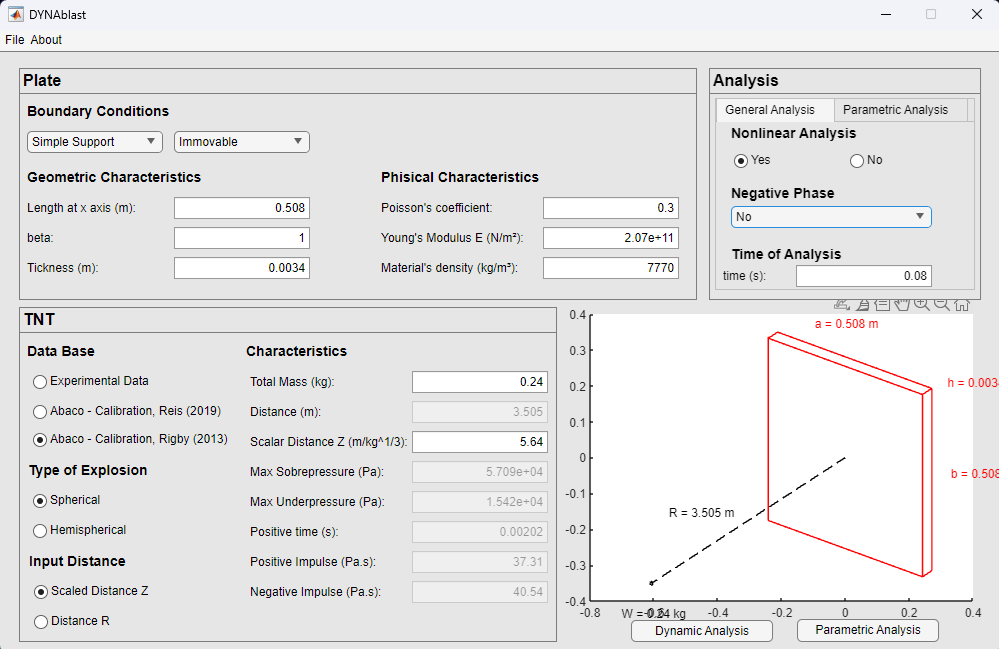
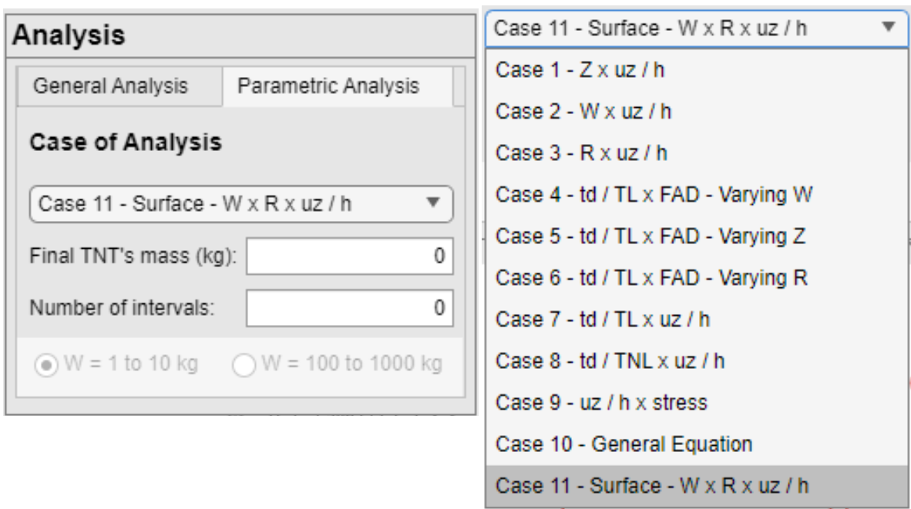
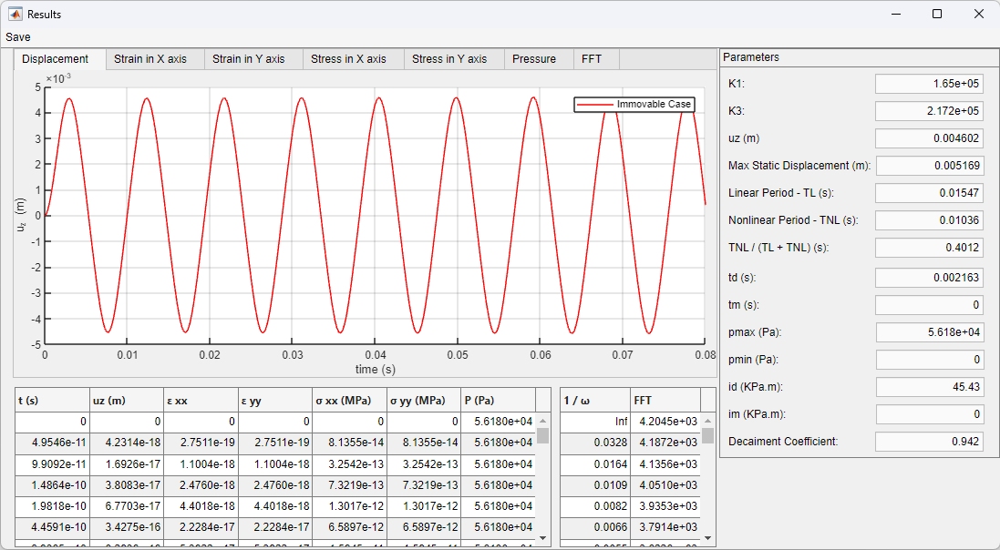
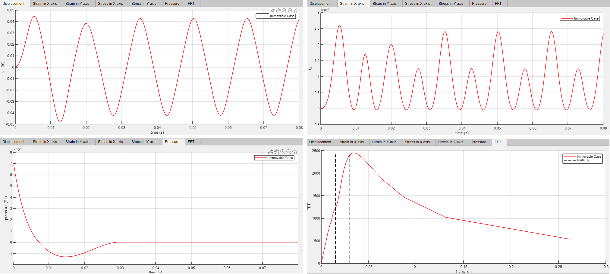
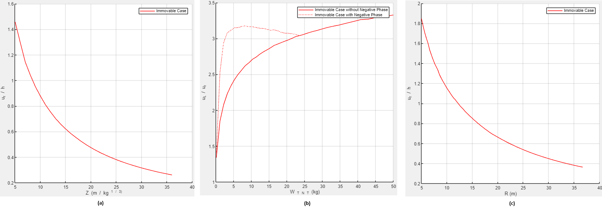
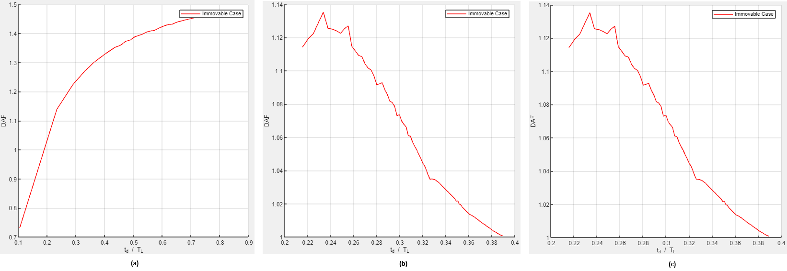
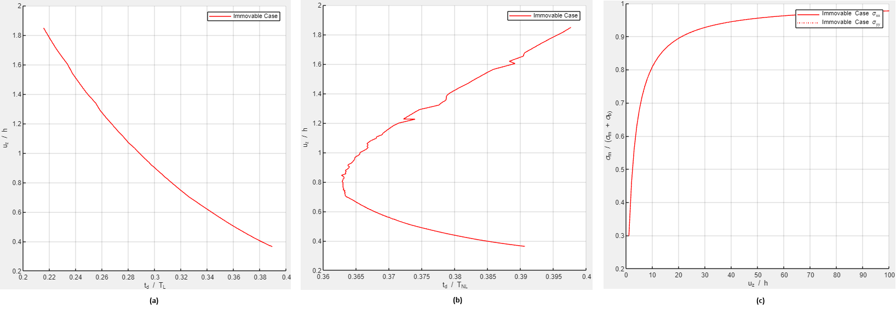
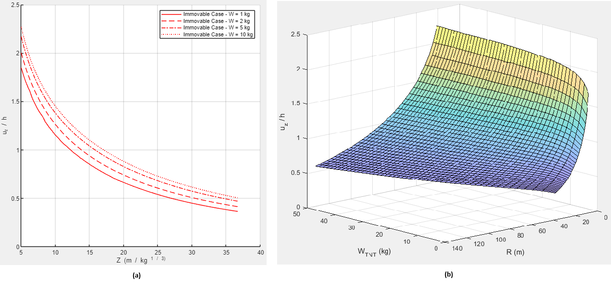
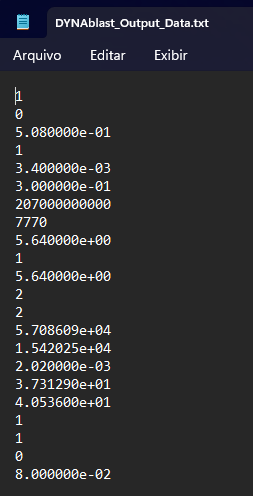
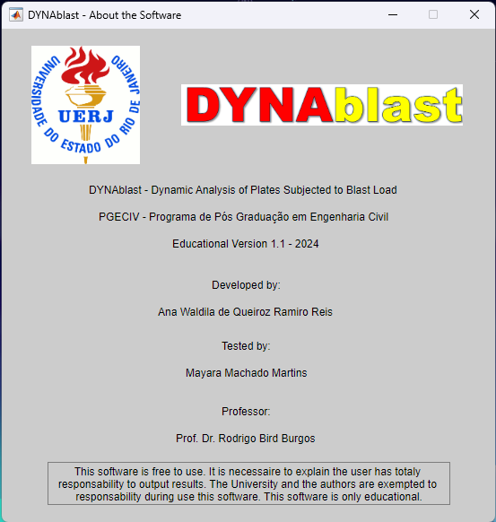

# DYNAblast Version 1.1

## Introduction

DYNAblast is a software developed in MATLAB language, designed to obtain the behavior of a thin plate when it is subjected to blast load, considering the membrane effect. By evaluating this type of structure when subjected to explosive loads, the engineer can understand its behavior and design a structure that would be resistant to a possible collapse. Other applications correspond to military, aeronautics, marine, and platform structures, for which impact loads, such as explosions, are usually considered. Because of this, Dynablast was developed to facilitate the analysis of displacements, strain, stress, and frequency content in the midpoint of a given plate. Furthermore, parametric analyses are also possible, such as DAF (Dynamic Amplification Factor), variation of the TNT mass and scaled distance.
DYNAblast 1.1 is a upload of [DYNAblast 1.0](https://github.com/AnaWaldila/dynablast).
The software DYNAblast 1.1 is registrated by brazilian registration number INPI BR512024002516-2.

## Methodology

All explanations and methodology about blast wave (definitions and formulations), theory of thin plates, and the mathematical solution are available in Reis (2019) and Reis et al. (2022). Reis (2019) is a Master's thesis and this study covers the dynamic behavior in plates considering the membrane effect (i.e, nonlinearity), subjected to blast loads. The second one is an article published in the Latin American Journal of Solids and Structures. DYNAblast uses several theories of thin plates and blast wave formulations.

## Software

When executed, the software opens a window, as shown in Figure 1, with some input data about the structure and the loading. 

 <b>Figure 1:</b> DYNAblast - Input Data

<b>Input Data</b>
About the plate structure, some pieces of information are important:

PLATE

* Boundary conditions of the plate: simply supported or fully clamped;
* Boundary conditions of the membrane: immovable, movable, or stress-free;
* Length in x-axis (m);
* Rate <i>&beta;</i> between length in x-axis and y-axis;
* Thickness (m);
* Poisson's ratio;
* Young's Modulus (N/m²);
* Material density (kg/m³).

In addition, the user also needs to know the plate, in this software, is a linear elastic material. All methodology about the mechanic of structures (plates) is presented in Reis (2019) and Reis et al. (2022).

TNT
* Data Base: "Experimental Data", "Abaco - Calibration, Reis (2019)" and "Abaco - Calibration, Rigby (2013)";
* Type of Explosion: Spherical or Hemispherical;
* Input Distance: Scaled Distance Z or Distance R;
* Characteristics: total mass (kg), distance (m), scalar distance (kg/m1/3), maximum overpressure (Pa), maximum underpressure (Pa), positive phase time (s), positive phase impulse (Pa.s), negative phase impulse (Pa.s). It is important to understand, based on which database is chosen by the user, some pieces of information about the blast wave's characteristics are not necessary.

In addition, about “Data Base”:
* “Experimental Data”: the labels “Total Mass (kg)”, "Distance (m)" and “Scaled Distance Z (kg/m^1/3)” are unable for edit, because all of them are based on an experimental values.
* "Abaco - Calibration, Reis (2019)" or "Abaco - Calibration, Rigby (2013)": “Total Mass (kg)” and Distance (“Scalar Distance Z (kg/m1/3)” or "Distance (m)" are enabled and other parameters in Characteristics are non enabled. "Abaco - Calibration, Reis (2019)" and "Abaco - Calibration, Rigby (2013)" are developed by Reis (2019) and Rigby et al. (2013), respectively, which is a characterization of all curves in the abacus presented in the US Department of Defense (2007). The algorithm used in “Rigby’s calibration” is from Rigby and Tyas (2014).
* Input Distance: The option "Scaled Distance Z" or "Distance R", in Input Distance, will enable only the options "Scaled Distance Z (m/kg^1/3)" or "Distance (m)", respectively. This will occurs only cconsidering the option choosen by the user is one of the "Abaco - Calibration".

ANALYSIS
* Nonlinear Analysis: Yes or No. If the user chooses "No", the boundary condition of the membrane is not considered in the code;
* Negative Phase: Now, there are 3 options, "No" (no negative phase will consider in the analysis), "Extended Positive Phase" (the Friedlander equation used to positive phase will be considered in the use of negative phase, i.e., its extended version) and "Cubic Equation" (the use of Granström equation to characterized the negative phase);
* Time of Analysis: history time of the analysis. In this case, “Time of Analysis” needs to be bigger than the total time of the pressure, i.e., positive phase time + negative phase time (if exists). If the user chooses a time that is smaller than those two, the program will show a message with the total time of the load pressure;
* Parametric Analysis: In parametric analysis, the user can choose 11 cases to analyze in "Case of Analysis":
  1. “Case 1 – Z x uz/h”: Analysis of the behavior of uz/h in comparison to the variation of Z, where the main step in Z; 
  2. “Case 2 – W x uz/h”: Analysis of the behavior of uz/h in comparison to the variation of W, where the main step in W. In this case, the user needs to complete the “Final TNT’s mass (kg)” and the “Number of intervals”. Consequently, in this case, is looping and the TNT’s mass to start this is completed in “Total mass (kg)” (in characteristics, TNT);
  3. “Case 3 – R x uz/h”: Analysis of the behavior of uz/h in comparison to the variation of R, where the main step in R; 
  4. “Case 4 – td/TL x FAD – Varying W”: A specific case to analyze the behavior of uz / h when DAF (Dynamic Amplification Factor) is varying. The main step is in W. In this case, the user needs to complete the “Final TNT’s mass (kg)” and the “Number of intervals”. Consequently, in this case, is looping and the TNT’s mass to start this is completed in “Total mass (kg)” (in characteristics, TNT); 
  5. “Case 5 – td/TL x FAD – Varying Z”: A specific case to analyze the behavior of uz / h when DAF (Dynamic Amplification Factor) is variating. The main step is in Z. 
  6. “Case 6 – td/TL x FAD – Varying R”: A specific case to analyze the behavior of uz / h when DAF (Dynamic Amplification Factor) is variating. The main step is in R. 
  7. “Case 7 – td / TL x uz / h”: A specific case to analyze the behavior of uz / h  when td / TL (rate between the time of duration of positive phase and the linear period of the structure) is varying. The main step is in Z;
  8. “Case 8 – td / TNL x uz / h”: A specific case to analyze the behavior of uz / h  when td / TNL (rate between the time of duration of positive phase and the non linear period of the structure) is varying. The main step is in Z;
  9. “Case 9 – uz / h x stress”: A specific case to analyze the behavior of uz / h  when stress is varying. The main step is in Z;
  10. “Case 10 – General Equation”: A specific case to calculate the same graph of “Case 1”, but showing an equation that characterizes the structure, i.e., a relation of uz/h, Z, and W.
  11. "Case 11 - Surface W X R X uz/h": A specific case to show a 3d graphic (surface) that characterizes the the maximum displacement of the plate (uz/h) when Z and W varying. In this case, the user needs to inform the "Final TNT's mass (kg)" and the "Number of intervals" between the initial and final mass (the initial mass is the input data into the label "Total Mass (kg)").

All cases are presented in Figure 2.

 <b>Figure 2:</b> DYNAblast - Input Data Cases of Analysis

BUTTONS
* Dynamic Analysis: In this case, output data presented are displacement, strain, and stress in the midpoint of the plate. The pressure of the loading and the Fast Fourier Transforms (FFT) are also calculated.
* Parametric Analysis: Parametric analysis is calculated and graphics are plotted based on the pieces of information of the "Parametric Analysis", i.e., the case choosen by the user.

<b>Output Data</b>
After the user introduces all input data, as shown in Figure 1, the user can press the button “Dynamic Analysis” or “Parametric Analysis”. The first one opens a new window, as presented in Figure 3, with the output data, i.e., tables with all displacements, stress, and strain per time, pressure, and the FFT. Also, some parameters are presented: K1, K3, uz (m), maximum static displacement (m), linear period - TL (s), nonlinear period - TNL (s), TNL / (TL + TNL), td (s), tm (s), pmax (Pa), pmin (Pa), id (Pa.m), im (Pa.m), decay coefficient. Some of those graphics are shown in Figure 4 and can also be seen in DYNAblast 1.0.

 <b>Figure 3:</b> DYNAblast - Results

 <b>Figure 4:</b> DYNAblast - Graphic Results

Clicking on the "Parametric Analysis" button, based on which case the user chose, as shown in Figure 2, one curve is plotted. Next, Figure 5 to 11 present the graphics of parametric analysis based on the input data presented in Figure 1.

 <b>Figure 5:</b> DYNAblast - Parametric Analysis. (a) Case 1 (b) Case 2 (c) Case 3

 <b>Figure 6:</b> DYNAblast - Parametric Analysis. (a) Case 4 (b) Case 5 (c) Case 6

 <b>Figure 7:</b> DYNAblast - Parametric Analysis. (a) Case 7 (b) Case 8 (c) Case 9

 <b>Figure 8:</b> DYNAblast - Parametric Analysis. (a) Case 10 (b) Case 11

All these examples considered the membrane’s boundary condition as immovable. The users can generate their own analysis with another type of boundary condition.

<b>Files</b>

All those pieces of information can be imported or exported to Excel or .txt file. Figure 1 shows, on the left top, a menu button called “File” which enables to save a new or import a txt file. The users can create a txt file with their own pieces of information about the plate, blast wave, and analysis. For this case, there is an order to follow:
1.	Plate boundary condition (1 for simple supported or 2 for fully clamped);
2.	Membrane boundary condition (1 for immovable, 2 for movable, and 3 for stress-free);
3.	Length in x-axis (m);
4.	<i>&beta;</i>;
5.	Thickness (m);
6.	Poisson’s ratio;
7.	Young’s Modulus E (N/m²);
8.	Material density (kg/m³);
9. 	Distance R (m);
10.	Total Mass (kg);
11.	Scaled Distance Z (kg/m^1/3);
12.	Type of explosion (1 for Hemispherical and 2 for Spherical)
13.	Data type (2 for "Abaco - Calibration, Rigby (2013)", 3 for "Abaco - Calibration, Reis (2019)" and 4 for "Experimental Data")
14.	Max Overpressure (Pa);
15.	Max Underpressure (Pa);
16.	Positive time (s);
17.	Positive impulse (Pa.s);
18.	Negative impulse (Pa.s);
19.	Input Distance (1 for "Scaled Distance Z" or 2 for "Distance R")
19.	Nonlinear analyses (1 for yes and 2 for no);
20.	Negative phase (0 for "No", 1 for "Extended Positive Phase" and 2 for "Cubic Equation")
21.	Time of analysis.

It is possible to observe all those pieces of information in Figure 9.

 <b>Figure 9:</b> DYNAblast - .txt file

For the graphics presented in Figures 3 to 8, it is possible to click the button on the top-left called “Save” and, consequently, save all output data in Excel.

<b>About</b>
This software was developed by Ph.D. Ana W. Q. R. Reis, supervised by Prof. Ph.D. Rodrigo B. Burgos and tested by Civil Engineer Mayara M. Martins, at Rio de Janeiro State University, as shown in Figure 10.

 <b>Figure 10:</b> DYNAblast - About the software

## References

Friedlander, F.G. The diffraction of sound pulses I. Diffraction by a semi-infinite plane. Communicated by G. I. Taylor, F.R.S., 1940.

Granström, S.A. Loading characteristics of fair blasts from detonating charges. Technical Report 100, Transactions of the Royal Institute of Technology, Stockholm, 1956

Reis, A.W.Q.R. Dynamic analysis of plates subjected to blast load. M. Sc. Dissertation (in Portuguese), Rio de Janeiro State University, Brazil, 2019.

Reis, A.W.Q.R., Burgos, R.B., Oliveira, M.F.F. DYNAblast—A software to obtain the behavior of plates subjected to blast loads. SoftwareX, 2022.

Reis, A.W.Q.R., Burgos, R.B., Oliveira, M.F.F. Nonlinear Dynamic Analysis of Plates Subjected to Explosive Loads. Latin American Journal of Solids and Structures, v. 19, 2022.

Rigby, S.E. and Tyas, A. (2014) Blast.m. CMD Group, University of Sheffield.

Rigby, S. E., Andrew, T., Bennett, T., Clarke, S. D., Fay, S. D. The Negative Phase of the Blast Load. International Journal of Protective Structures 5(1):1-19, 2013.

## About the Software

Rio de Janeiro State University

Faculty of Engineering

Developer: Ph.D. Ana Waldila de Queiroz Ramiro Reis

Tester: Civil. Eng. Mayara Machado Martins

Professor: Ph.D. Rodrigo Bird Burgos

E-mail: anawaldila@hotmail.com
